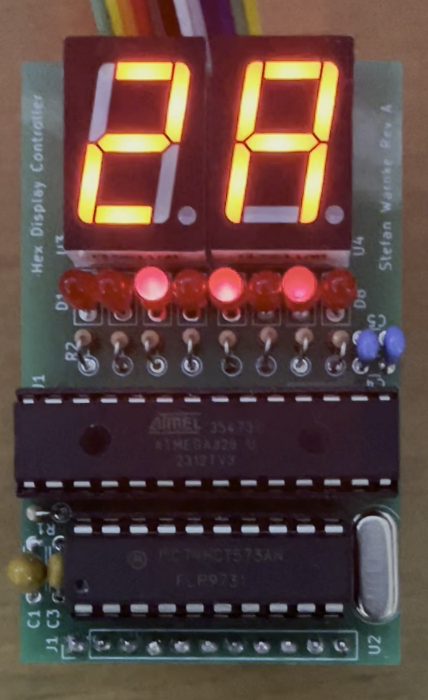
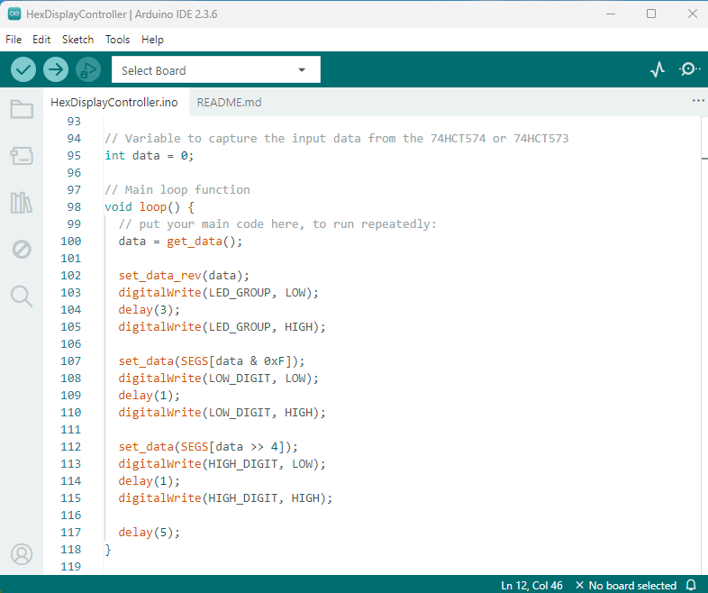
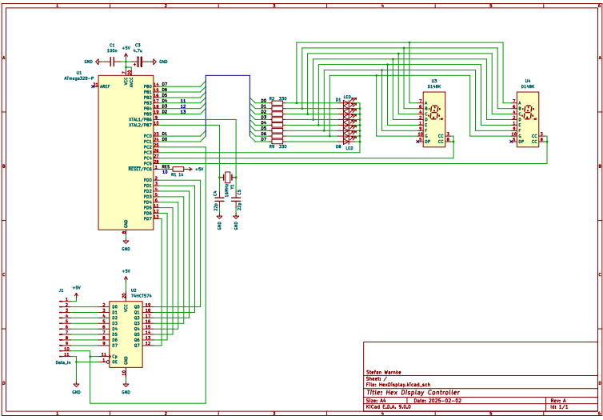
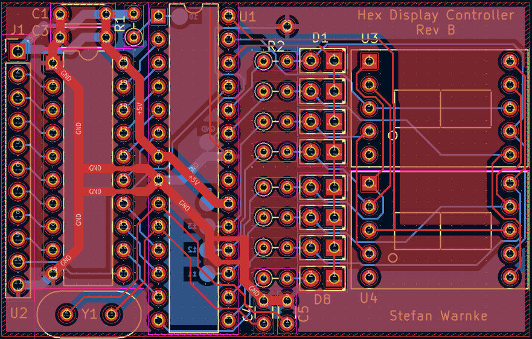

<h1 style="text-align: center;">HexDisplayController</h1>
<h2 style="text-align: center;">A hexadecimal display module for TTL designs</h2>
 

  

 
This small PCB reads an 8-bit input and converts the binary code to a 2 digit 7-segment LED as hexadecimals and 8 single bit LEDs. An input register can capture and hold the input data.
  

  

 
The processor had been programmed on an Arduino Uno R3 board and then plugged into this controller. 
  

  

 
The schematic and layout are design in KiCad 9 and the design files are included in the repository.
  

  

 